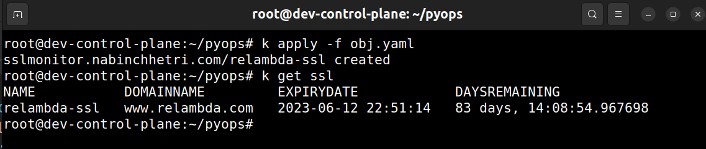

# k8s-kopf-sslmonitor-operator
k8s-kopf-sslmonitor-operator checks the expiry date of the given domain and it gives the date of expiry of SSL and the days remaining.

It is build on top of Kubernetes Operator Pythonic Framework (Kopf).

## Requirements
-  kubectl
-  kind or minikube
-  kopf

## Run in Development

- Clone the repository on your local machine
```bash
git clone <url>
cd <to_folder>
```

- Create virtual environment
```bash
python3 -m venv env
```
- Install the required python packages.

```bash
pip3 install -r requirements.txt
```
- Apply the custom resource definition.
```bash
kubectl apply -f crd.yaml
```
- Check whether crd is applied or not.
```bash
kubectl api-resources
```
- Run controller.py in a background.
```bash
kopf run controller.py --verbose
```
- Create a object of the custom resources.
```bash
kubectl apply -f obj.yaml
```
- Check whether the custom resource objects is created or not.

```bash
kubectl get ssl
```


## Deploy in Kubernetes 
- First, Create a Dockerfile to package the controller and its dependencies.

```bash
# Dockerfile
FROM python:3.8-alpine
WORKDIR src
COPY requirements.txt requirements.txt
RUN pip install --upgrade pip && \
    pip install --no-cache-dir -r requirements.txt
COPY controller.py controller.py
CMD kopf run -A controller.py --verbose
```

- Build the docker image using the Dockerfile.

```bash
docker build -t nabinchhetri/sslmonitor:<tag> . --no-cache
```

- Configure a RBAC manifests file with service accounts, cluster role and cluster role bindings for a docker image.

```bash
# rbac.yaml
---
apiVersion: v1
kind: ServiceAccount
metadata:
  name: sslmonitor-sa
---
apiVersion: rbac.authorization.k8s.io/v1
kind: ClusterRole
metadata:
  name: sslmonitor-clusterrole
rules:
  - apiGroups: [""]
    resources: ["pods"]
    verbs: ["get", "list", "watch", "create", "update", "patch", "delete"]

  - apiGroups: ["nabinchhetri.com"]
    resources: ["sslmonitors"]
    verbs: ["get", "patch", "list", "watch", "create", "update", "delete"]
---
apiVersion: rbac.authorization.k8s.io/v1
kind: ClusterRoleBinding
metadata:
  name: sslmonitor-clusterrole-binding
roleRef:
  apiGroup: rbac.authorization.k8s.io
  kind: ClusterRole
  name: sslmonitor-clusterrole
subjects:
- kind: ServiceAccount
  name: sslmonitor-sa
  namespace: default
```

- Configure a deployment manifest file with the service account associated to it.

Note: Always use the new docker image tag for running in kubernetes.

```bash
# deployment.yaml
apiVersion: apps/v1
kind: Deployment
metadata:
  name: ssl-operator-deployment
spec:
  replicas: 1
  strategy:
    type: Recreate
  selector:
    matchLabels:
      application: ssl-operator
  template:
    metadata:
      labels:
        application: ssl-operator
    spec:
      serviceAccountName: sslmonitor-sa
      containers:
      - name: sslmonitoring
        image: nabinchhetri/sslmonitor:<tag>
```
- Configure the custom resources objects.
```bash
apiVersion: nabinchhetri.com/v1
kind: SSLMonitor
metadata:
  name: relambda-ssl
spec:
  domain_name: www.relambda.com
```

- Apply the kubernetes manifests file.

```bash
kubectl apply -f crd.yaml
kubectl apply -f rbac.yaml
kubectl apply -f deployment.yaml
kubectl apply -f obj.yaml
```
- Check the ssl resources.

```bash
kubectl get ssl
```

## Expiry notifications via GoogleChat
- First you need to create a new space in googlechat spaces.
- Then go to manage apps and integrations and click manage webhooks.
- Create a new googlechat webhook and copy the googlechat webhook url.
- Use the googlechat webhook  url in the manifests like like

```bash
apiVersion: nabinchhetri.com/v1
kind: SSLMonitor
metadata:
  name: <sslmonitor-name>
spec:
  domain_name: <domain-name>
  alert_threshold_days: <days> # default 30
  googlechat_webhook_url: <url>
```